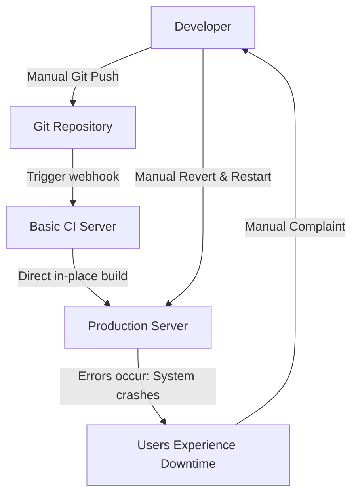
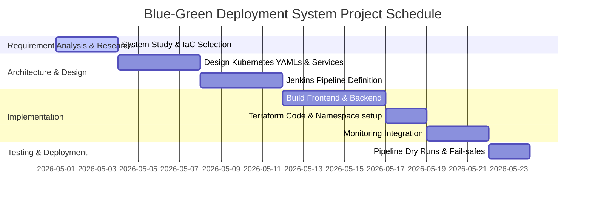
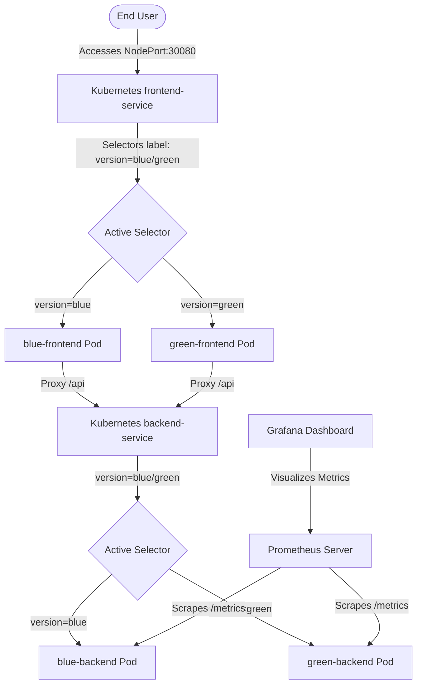
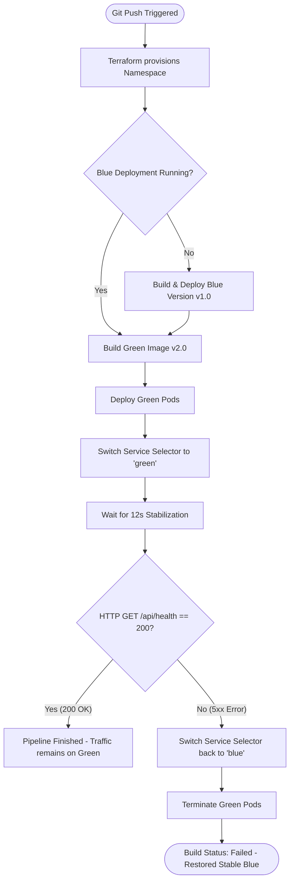

# PROJECT REPORT: AUTOMATED BLUE-GREEN DEPLOYMENT PIPELINE WITH TELEMETRY SCRAPING IN KUBERNETES

## 1. Introduction
Modern software release workflows prioritize high availability and minimal service disruption during upgrades. This project describes the implementation of a local continuous integration and continuous delivery (CI/CD) pipeline that automates a Blue-Green deployment strategy. The environment is hosted on a local Kubernetes cluster (Minikube). It consists of a containerized React (Vite) frontend application and an Express (Node.js) backend API. Terraform is used to provision the Kubernetes namespaces. Automation is managed by a Jenkins pipeline that runs automated health checks and controls traffic routing via service selector patches. Application instrumentation is accomplished using a Prometheus client to expose request metrics for collection and visualization via Grafana.

---

## 2. Profile of the Problem / Rationale & Scope of the Study
### Problem Statement
During typical software updates, standard in-place deployments frequently introduce service interruptions, compatibility discrepancies, or prolonged recovery windows if a newly published application version fails. Specifically, the challenges include:
1. **Transition State Latency**: Taking resources offline during upgrade cycles creates a service gap.
2. **High-risk Rollbacks**: Reverting a failed deployment requires redeploying old source code or manually modifying configurations, which increases system recovery time.
3. **Lack of Instantaneous Telemetry**: The absence of immediate performance metrics during the transition makes it difficult to detect errors during the update process.

### Rationale & Scope of the Study
This project implements a Blue-Green deployment model to resolve these issues. By maintaining two identical production environments (named Blue and Green), the active environment can be switched using service selector modifications.

The scope of this project includes:
- Deploying isolated replicas of the application (frontend and backend tiers) in a dedicated Kubernetes namespace.
- Scripting a Jenkins pipeline to automate building, testing, routing transitions, and fail-safe recovery logic.
- Using Prometheus to gather runtime metrics and using Grafana to visualize HTTP transaction rates and error anomalies.

---

## 3. Existing System
### Introduction
Traditional staging-to-production pipelines deploy upgrades directly in-place (Rolling Updates or Recreate Deployments). These models suffer from transitional instabilities, state mismatch, and lagging user sessions due to browser caching.

### Existing Software
Standard continuous delivery tools (e.g., raw bash scripting combined with manual virtual machine updates) lack immediate traffic-switching orchestration and feedback loops from runtime monitoring systems.

### DFD for Present System
The traditional manual deployment pipeline does not include continuous monitoring feedback loops or isolated candidate verification. This flow is illustrated below:



### What's New in the System to be Developed
1. **Label-Based Traffic Routing**: Kubernetes Services are patched at runtime to direct traffic via label selectors.
2. **Non-Intrusive Validation**: Newly deployed images are tested in the active cluster prior to complete traffic shifting.
3. **Active Cache Defeating**: The web server (Nginx) configuration explicitly includes headers to suppress browser-level caching of static assets.
4. **Automated Telemetry**: Real-time response statistics are scraped directly from application endpoints to identify transition anomalies.

---

## 4. Problem Analysis
### Product Definition
The system is an automated, local Kubernetes-hosted software delivery pipeline. It includes two identical production-like environments, automated integration scripts, and real-time metric scrapers to manage software releases safely.

### Feasibility Analysis
1. **Technical Feasibility**: The infrastructure is built with standard DevOps tools: Docker for containerization, Kubernetes for pod orchestration, Terraform for workspace isolation, and Jenkins for pipeline management. This setup is technically feasible on general-purpose hardware.
2. **Operational Feasibility**: Automated pipeline tasks run in response to version control pushes. System administrators do not need to manually configure infrastructure during releases.
3. **Economic Feasibility**: The pipeline uses open-source software, making it economically practical to deploy and manage without license costs.

### Project Plan
The schedule represents the critical phases of requirement gathering, design, coding, integration, and validation:



---

## 5. Software Requirement Analysis
### Introduction
This section defines the hardware and software resource limits needed to run the local cluster and pipeline components.

### General Description
The target application is structured as a two-tier microservice:
- **Frontend Tiers**: A static React build wrapped inside an Nginx instance.
- **Backend Tiers**: A Node.js API server exposing operational endpoints and gathering Prometheus metrics.

### Specific Requirements
#### Software Requirements
- **Hypervisor/Container Engine**: Docker Engine v20.10+
- **Local Kubernetes Cluster**: Minikube v1.28+ (supporting ingress and metrics-server addons)
- **Infrastructure Provisioner**: Terraform v1.0.0+
- **Automation Platform**: Jenkins LTS
- **Monitoring Stack**: Prometheus v2.40+ and Grafana v9.0+

#### Hardware Requirements (Minimum Recommended)
- **Processor**: Multi-core x86-64 Processor (4 physical cores minimum)
- **RAM**: 16 GB system memory (allocated to support Minikube, Docker, and the local Jenkins engine)
- **Disk Space**: 40 GB solid-state drive space (SSD) for caching local container images

---

## 6. Design
### System Design
The system layout uses label selectors inside Kubernetes Service resources to map incoming ports to either Blue or Green deployment targets dynamically:



### Design Notations
- **Pods**: Groupings of containerized application runtimes.
- **Services**: High-level abstractions defining persistent ingress points mapping to target pods.
- **Namespaces**: Logical isolation domains splitting demo resources from system processes.

### Detailed Design
#### Static File Routing and Caching Overrides
The frontend reverse proxy is configured via an Nginx block that forwards API queries to the backend service. It injects specific control headers to bypass intermediate cache servers.
#### Prometheus Scraping Target
An active scrape job is declared in the monitoring namespace, pointing to the internal DNS name of the backend: `backend-service.blue-green-demo.svc.cluster.local:5000/metrics`.

### Flowcharts
The pipeline flowchart tracks the execution path from git trigger down to deployment checks and rollbacks:



### Pseudo Code
The Jenkinsfile pipeline stages are modeled in the procedural block below:
```python
def pipeline_execution():
    # Stage 1: Setup Namespace via Terraform
    directory_change("terraform")
    terraform_init()
    terraform_apply()
    directory_change("..")
    
    # Stage 2: Verify and Deploy Blue Base
    docker_env_eval()
    if not kubernetes_deployment_exists(name="blue-frontend", namespace="blue-green-demo"):
        build_docker_image(tag="devops-proj/frontend:blue", build_arg="VERSION=blue", path="./frontend")
        build_docker_image(tag="devops-proj/backend:blue", build_arg="VERSION=blue", path="./backend")
        kubernetes_apply("k8s/blue-deployment.yaml")
        kubernetes_apply("k8s/service.yaml")
        thread_sleep(10)
        
    # Stage 3: Build Green Images
    try:
        build_docker_image(tag="devops-proj/frontend:green", build_arg="VERSION=green", path="./frontend")
        build_docker_image(tag="devops-proj/backend:green", build_arg="VERSION=green", path="./backend")
    except BuildException as e:
        pipeline_abort(message="Green Image Build Failed. System Unchanged.")
        
    # Stage 4: Deploy Green Candidate
    kubernetes_apply("k8s/green-deployment.yaml")
    
    # Stage 5: Shift Routing Selector to Green
    kubernetes_patch_service(service="frontend-service", selector="green")
    kubernetes_patch_service(service="backend-service", selector="green")
    
    # Stage 6: Perform Integration Health Check
    thread_sleep(12)
    minikube_host = get_minikube_ip()
    http_response_code = execute_http_get(url=f"http://{minikube_host}:30080/api/health")
    
    # Stage 7: Evaluate Validation Response
    if http_response_code != 200:
        log_warning("Health Check Failed! Restoring stable Blue state...")
        kubernetes_patch_service(service="frontend-service", selector="blue")
        kubernetes_patch_service(service="backend-service", selector="blue")
        kubernetes_delete_deployment(name=["green-frontend", "green-backend"])
        terminate_pipeline(status="FAILED")
    else:
        log_info("Deployment Successful. Green version promoted to active production.")
        terminate_pipeline(status="SUCCESS")
```

---

## 7. Testing
### Functional Testing
Tests verified routing behavior by polling the application version endpoint. The target returned the assigned environment label (`blue` or `green`) based on the current service routing configuration.

### Structural Testing
To test the pipeline's recovery behavior, a fault was injected into the backend application source code:
```javascript
app.get('/api/health', (req, res) => {
  return res.status(500).json({ status: 'error', version: VERSION });
});
```
The pipeline successfully detected the non-200 HTTP code during execution and automatically rolled back traffic to the stable Blue pods.

### Levels of Testing
- **Unit Level**: Checked the syntax of components during static builds.
- **Integration Level**: Verified the communication path between frontend proxies and API backend services inside Kubernetes.
- **System Level**: Validated the complete delivery cycle, including triggers, building, and rollback processes.

### Testing the Project
| Test ID | Scenario | Expected Output | Observed Output | Result |
|---|---|---|---|---|
| TC-01 | Healthy Update | Green environment promoted | Traffic routed to Green | PASS |
| TC-02 | Fault Injection | Pipeline triggers rollback | Traffic restored to Blue | PASS |
| TC-03 | Telemetry Verify | Metrics scraped on endpoint | Grafana shows HTTP metrics | PASS |

---

## 8. Implementation
### Implementation of the Project
The code was deployed using Docker environment hooks inside Minikube. Initial configurations:
- **IaC Configuration**: Terraform files configured inside the `terraform` directory managed namespace allocations.
- **Manifest Declarations**: Declarative files in the `k8s` folder mapped deployment specs and NodePorts.
- **Alerting Config**: Custom rules configured in the Prometheus stack logged network rates and tracked anomalies.

### Conversion Plan
Upgrading the infrastructure to use Blue-Green deployments was handled via a **parallel transition strategy**:
- The active Blue deployment handles client requests.
- The Green environment is deployed and verified in isolation within the same namespace.
- A patch command updates service selectors to swap active targets.

### Post-Implementation & Software Maintenance
Declarative files are tracked in source control. Monitoring parameters inside Grafana are reviewed regularly to verify node utilization limits.

---

## 9. Project Legacy
### Current Status of the Project
The pipeline is fully operational locally. Build schedules are triggered on push events via ngrok tunnels forwarding webhooks directly from GitHub repositories to the local Jenkins daemon.

### Remaining Areas of Concern
- **Persistent State Databases**: High-availability database replication configurations are needed to prevent data collision between blue/green versions.
- **Auto-Scaling Rules**: Adding Horizontal Pod Autoscalers (HPA) to scale pod replicas based on traffic load dynamically.

### Technical & Managerial Lessons Learnt
- **Fail-Fast Principles**: Catching application failures early in the CI stage protects users from system instability.
- **Infrastructure as Code (IaC)**: Declarative configurations guarantee environment stability, preventing discrepancies between staging and production stages.

---

## 10. User Manual
### Help Guide
1. **Initialize Cluster & Connect Shell**:
   ```bash
   minikube start --driver=docker
   minikube addons enable ingress
   minikube addons enable metrics-server
   eval $(minikube docker-env)
   ```
2. **Deploy Telemetry Infrastructure**:
   ```bash
   helm repo add prometheus-community https://prometheus-community.github.io/helm-charts
   helm repo update
   helm install monitoring prometheus-community/kube-prometheus-stack --namespace monitoring --create-namespace
   kubectl apply -f k8s/servicemonitor.yaml
   kubectl apply -f prometheus/alert-rules.yaml
   ```
3. **Expose Dashboards**:
   - Grafana dashboard: `kubectl port-forward svc/monitoring-grafana 3000:80 -n monitoring` (default user: `admin`, pass: `prom-operator`)
   - Prometheus server: `kubectl port-forward svc/monitoring-prometheus-kube-prometheus-prometheus 9090:9090 -n monitoring`
4. **Trigger Build**:
   - Push updates to the repository. The Jenkins pipeline triggers dynamically, builds the version, deploys to Kubernetes, runs health validation, and routes traffic automatically.

---

## 11. Source Code & System Snapshots
### Sample Code: Dockerfile (Conditional Build argument)
```dockerfile
FROM node:18-alpine AS build
WORKDIR /app
COPY package*.json ./
RUN npm install
COPY . .

ARG VERSION=blue
RUN if [ "$VERSION" = "green" ]; then cp src-green/App.jsx src/App.jsx; fi

RUN npm run build
FROM nginx:alpine
COPY --from=build /app/dist /usr/share/nginx/html
COPY nginx.conf /etc/nginx/conf.d/default.conf
EXPOSE 80
CMD ["nginx", "-g", "daemon off;"]
```

### Sample Code: Express Prometheus Metrics Tracker (`backend/app.js`)
```javascript
const client = require('prom-client');
const register = new client.Registry();
client.collectDefaultMetrics({ register });

const httpRequestsTotal = new client.Counter({
  name: 'http_requests_total',
  help: 'Total number of HTTP requests processed',
  labelNames: ['method', 'handler', 'status']
});
register.registerMetric(httpRequestsTotal);
```

---

## 12. Bibliography
1. **Kubernetes Up & Running**: Dive into the Future of Infrastructure, 2nd Edition - Brendan Burns, Joe Beda, Kelsey Hightower.
2. **Terraform: Up & Running**: Writing Infrastructure as Code - Yevgeniy Brikman.
3. **Continuous Delivery**: Reliable Software Releases through Build, Test, and Deployment Automation - Jez Humble, David Farley.
4. **Prometheus Documentation**: Monitoring Systems and Alerting Toolkits (https://prometheus.io/docs/).
